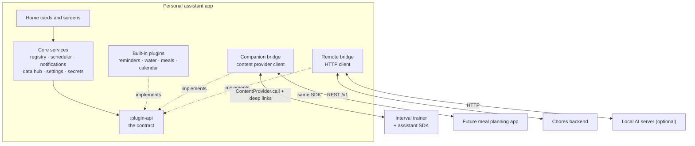

# Plugin architecture research

Research for #4 (integrations #5 to #13). Input for the plugin boundary decision note, #18. Status: research; nothing here is decided until #18 records it.

Written 2026-09-29.

How the personal assistant can pull in the interval trainer, chores, calendar and the rest, with each integration living in its own box and the core knowing nothing about any of them.

## Summary

**One contract, three ways to reach it.** Every plugin, wherever it lives, describes itself the same way: a manifest listing the data it offers, the actions it accepts, the reminders it wants scheduled and the settings it needs. The contract is plain Kotlin data that serialises to JSON, so the same plugin shape works whether the code is compiled into the assistant, lives in another of the owner's Android apps, or sits behind a web API.

**The core owns the shared things.** Scheduling, notifications, the home-screen cards, stored metrics, settings and secrets all belong to the core. Plugins hand the core data and it renders it, so a plugin never touches Compose and never talks to another plugin directly.

**Adding a plugin is additive.** A new built-in plugin is one Gradle module that depends only on the contract module, plus one line to register it. A new companion app adds a small SDK and a content provider. Nothing in the core changes.

## What the owner's other apps look like

The research read the two existing apps the issues name. They are shaped very differently, and that difference is the main reason the design needs more than one transport.

### Interval trainer ([Interval-trainer-android](https://github.com/derekwinters/Interval-trainer-android))

- Fully local. Presets live in a Room database in a Kotlin Multiplatform `:database` module, with a pure-JVM `:core` and a thin Android `:app` (its ADR 0005). The same split suits the assistant.
- It exposes nothing to other apps today. Only the launcher activity is exported; `WorkoutService` is `exported="false"` (`app/src/main/AndroidManifest.xml`).
- The running workout is a `mediaPlayback` foreground service driven by a `WorkoutCommand` vocabulary: Start(presetId), Pause, Resume, Skip, Stop, ToggleMute.
- There is no workout history. `docs/spec/schema.md` says history is out of scope for v1 and a future `workouts` table is an additive v2 change (SCHEMA-044). So "show recent workouts" in #5 depends on that table existing first; "start preset X" does not.
- Releases are signed with a stable key whose SHA-256 is pinned in `.github/release-cert-sha256.txt`. That pin is exactly what the assistant can check against before trusting the app.

### Chores ([chores-web-backend](https://github.com/derekwinters/chores-web-backend), [chores-web-android](https://github.com/derekwinters/chores-web-android))

- The Android app is a thin client. The data and logic live in a self-hosted FastAPI backend with a versioned REST API under `/v1` and an OpenAPI file published in [chores-web-docs](https://github.com/derekwinters/chores-web-docs) at `docs/api/openapi.json`.
- The endpoints #6 needs already exist: `GET v1/chores`, `POST v1/chores/{id}/complete`, `/skip`, `/reassign`, and `GET v1/notifications` (`data/network/ChoresApi.kt`).
- Auth is a bearer JWT from `POST v1/auth/login`, valid for 365 days (`app/routers/auth.py`). It acts as the full user; there is no scoped API token.
- The chores app already polls `v1/notifications` and posts its own notifications (`notifications/NotificationPollWorker.kt`). If the assistant also surfaces due chores, the two apps will double-notify unless one of them stands down.

The conclusion for #6: integrate with the chores *backend* over HTTP, not with the chores Android app. For #5 the only route is on-device IPC, which means a small addition to the interval trainer repo.

## The shape

The core depends on one module, `:plugin-api`. Everything else plugs into it from the outside. The three kinds of plugin differ only in where their code runs; to the core they are all the same interface.



The dashed lines are "implements". The core never imports a plugin module; it only sees what the registry hands it.

## Modules and dependency rules

```text
:plugin-api          pure Kotlin (JVM). Manifest, actions, feeds, cards, schedules. kotlinx.serialization only.
:core                pure Kotlin. Registry, scheduler logic, data hub logic. Depends on :plugin-api.
:app                 Android shell. Compose UI, WorkManager, NotificationManager, DataStore, Keystore.
:plugins:reminders   one module per built-in plugin. Depends on :plugin-api and nothing else.
:plugins:water
:plugins:calendar    (may use Android APIs, so an Android library module, still only :plugin-api)
:bridges:companion   content-provider client that turns each discovered companion app into a plugin.
:bridges:remote      HTTP client that turns a configured endpoint into a plugin.
:plugins:bundle      the only module that lists the plugins; :app depends on it.
:plugin-sdk-android  what a companion app adds: provider base class, caller check, JSON envelope.
:plugin-testkit      conformance tests any plugin runs against itself.
```

Three rules keep this modular, and each can be a failing test rather than a convention:

- A plugin module depends on `:plugin-api` (and Android/third-party libraries), never on `:core`, `:app` or another plugin.
- `:core` and `:app` never depend on a plugin module directly. Only `:plugins:bundle` names them.
- `:plugin-api` and `:core` have no Android dependency, so the contract and the registry are tested as plain JVM unit tests. This matches the interval trainer's ADR 0005 and its constraint that CI has no emulator.

## The plugin contract

A plugin is described by data. The core reads the manifest, shows the plugin's cards, schedules its reminders, offers its actions on notifications and in the UI, and (later) hands its actions to the AI model as tools. This sketch is illustrative, not final code.

```kotlin
interface AssistantPlugin {
    val manifest: PluginManifest
    suspend fun query(feed: String, params: JsonObject): FeedResult      // read data
    suspend fun invoke(action: String, input: JsonObject): ActionResult  // do something
    fun changes(): Flow<String> = emptyFlow()                            // "feed X changed"
}

@Serializable data class PluginManifest(
    val id: String,              // "chores", stable forever
    val displayName: String,
    val version: String,         // the plugin's own version
    val apiVersion: Int,         // which contract version it speaks
    val feeds: List<FeedSpec>,       // e.g. "due" -> AgendaItem list
    val actions: List<ActionSpec>,
    val schedules: List<ScheduleSpec> = emptyList(),
    val settings: List<SettingSpec> = emptyList(),
    val androidPermissions: List<String> = emptyList(),
)

@Serializable data class ActionSpec(
    val name: String,            // "complete"
    val description: String,     // human sentence; also the AI tool description
    val input: JsonSchema,       // what the action accepts
    val effect: Effect,          // READ, REVERSIBLE, IRREVERSIBLE
    val opensUi: Boolean = false // true when it must launch an activity (start a workout)
)
```

### Shared vocabulary

Plugins return a handful of core-defined types instead of their own models, so the core can merge them without knowing where they came from:

- **AgendaItem**: something with a time and a title, such as a chore due today, a calendar event or a planned workout. The home screen's "today" view is every plugin's agenda feed merged by time.
- **MetricSample**: a key, a value, a unit and a timestamp, such as `water.intake 250 ml`. Stored by the core, so reminders can read today's water total without depending on the water plugin.
- **Card**: a title, a few lines and up to two actions. This is how every plugin appears on the home screen, whether it is built in, a companion app or a remote API.

Built-in plugins may add a full Compose screen through an optional `ScreenProvider`. Companion and remote plugins get cards only, plus a deep link into their own app when they need more. That keeps the UI consistent and stops the contract from having to carry UI.

### Always included, enabled at runtime

Every plugin and bridge is compiled into every build. Whether it runs is a per-plugin switch in settings, stored by the registry. A disabled plugin is completely inert: it schedules nothing, posts nothing, asks for no Android permissions, makes no network calls and shows no cards. A companion bridge shows up as available only when its app is installed. The modularity comes from the module boundaries and dependency rules, not from leaving code out of the APK, so there is no need for build flavours.

### Goals are a core feature

A goal such as "work out 3 times a week" belongs to the assistant, not to the plugin. The core counts Records of a given kind over a period and compares them with a target. The interval trainer only supplies history. The same goal engine then works for "8 glasses of water a day" or "all chores done by Sunday" with no extra code in those plugins.

### Versioning

The contract carries one integer `apiVersion`. Changes inside a version are additive only, and every decoder ignores unknown fields, so an older companion app keeps working with a newer assistant. The host declares the range it supports and disables a plugin outside that range with a visible reason instead of crashing.

## Interaction types

Every cross-app interaction falls into one of seven types. Each type has one fixed mechanism per transport and one fixed set of rules, so a new integration is described as a list of typed interactions and inherits everything else. The list is closed on purpose: adding a type is a contract version change, not something a plugin does.

| Type | What it is | Rules that come with it | Companion app | Remote API |
| --- | --- | --- | --- | --- |
| **Read** | The assistant pulls data from a plugin. | No side effects. Safe in the background, safe for the AI to call, results may be cached. | `call("query")` | `GET` |
| **Command** | The assistant asks a plugin to change something, with no UI. | Must declare its effect. Reversible commands offer undo; irreversible ones always ask the user first. | `call("invoke")` | `POST`/`PUT` |
| **Hand-off** | The assistant opens the other app at a specific place. | Only from a user tap while the assistant is in front. Never from the background or the AI without asking. | Deep link intent | Link to its app or site |
| **Change signal** | A plugin tells the assistant that something changed. | Carries no data, only "feed X changed". The assistant then does a Read, so there is one data path. | `notifyChange` | Polling (or push later) |
| **Reminder request** | A plugin asks the core to nudge the user at a time or interval. | The core decides when it fires, applying quiet hours, snooze and context. | Declared in the manifest; runs in the core | Declared in the manifest; runs in the core |
| **Context signal** | A plugin supplies a state other features use. | Read-only for everyone else. Plugins never read each other, only the core's current context. | Declared in the manifest; stored in the core | Declared in the manifest; stored in the core |
| **Record** | A plugin adds an entry to the core's shared history. | Append-only with a timestamp and source, so any plugin (or the AI) can read totals and trends. | Written through the core's data hub | Written through the core's data hub |

### Each integration, by type

| Integration | Read | Command | Hand-off | Change signal | Reminder | Context | Record |
| --- | --- | --- | --- | --- | --- | --- | --- |
| #5 Interval trainer | Workout history | None | Open the app (later: start a preset) | Workout finished | Behind on weekly goal | None | Workout done |
| #6 Chores | Due and overdue | Complete, skip, reassign | Open a chore | Chore became due (poll) | Due chore nudge | None | Chore completed |
| #7 Calendar | Today's events | None (read only to start) | Open an event | Calendar changed | None | In a meeting | None |
| #8 Reminders | Upcoming reminders | Snooze, skip | None | None | Stretch, drink water | Working hours | Reminder acted on |
| #9 Water | Today vs goal | Log amount | None | None | Adaptive drink nudge | None | Water intake |
| #10 Meals | Today's meals | Log meal | None | None | Meal time nudge | None | Meal eaten |
| #11 Keep / #12 Meal app | Grocery list, meal plan | Add item, check off | Open the list | List changed | None | None | None |
| #13 Local AI | Uses freely | Within its effect rules | Only when the user taps | — | Never sends | Never sends | Never sends |

#13 Local AI uses Read freely, Command within its effect rules, and Hand-off only when the user taps. It never sends Reminder, Context or Record itself.

The interval trainer row shows why the types help: its only headless interaction is Read. Opening the app is a Hand-off, and starting a specific preset later is the same Hand-off with one more parameter, so it can be added without changing the contract.

## What the core owns

| Service | What it does | Why the core owns it |
| --- | --- | --- |
| Registry | Finds plugins, checks `apiVersion`, stores enabled or disabled per plugin, disables one that throws. | One place to answer "what is installed and working". |
| Scheduler | Plugins declare `ScheduleSpec`s (every 60 minutes during work hours, at 8am). The core runs them on WorkManager and inexact alarms. | Quiet hours, snooze and "not during a meeting" behave the same for every reminder. Answers the open question in #8. |
| Notifications | One channel per plugin; notification buttons are plugin actions, so "Log 250 ml" on a water reminder calls `water.log`. | Users can mute a plugin in Android settings, and one-tap logging (#9) works without the plugin touching NotificationManager. |
| Data hub | Stores MetricSamples and caches feed results; answers cross-plugin queries. | Plugins read each other's data only through the core, never directly. |
| Settings and secrets | Renders each plugin's settings from its `SettingSpec`s; keeps tokens in Keystore-backed storage. | A plugin never sees another plugin's token, and settings screens stay uniform. |
| Context | Signals such as "working now", "in a meeting", "quiet hours". | Any plugin can provide a signal (calendar provides "in a meeting") and the scheduler consumes it, without the reminder plugin knowing calendar exists. |

## The three transports

| Transport | Kind | What it is | Used for |
| --- | --- | --- | --- |
| In-process | Built-in module | A Kotlin class in a Gradle module. Cheapest to build and test. | Reminders, water, meals, calendar. |
| Companion app | Another of the owner's apps | The app ships the SDK and an exported content provider. | Interval trainer and the future meal planning app. |
| Remote | A web API | An HTTP bridge maps a REST API to the contract. | Chores backend, a LAN AI server, a meal app with a backend. |

### Companion apps: content provider, not a bound service

The research recommends `ContentProvider.call(method, arg, extras)` over AIDL or a bound service. It is a synchronous request and response with no binding lifecycle to manage, the provider can identify its caller with `getCallingPackage()`, and a single method carrying a JSON envelope means the IPC surface never changes when the contract grows.

```kotlin
// in the companion app, via :plugin-sdk-android
class TrainerAssistantProvider : AssistantPluginProvider() {
    override fun plugin(): AssistantPlugin = TrainerPlugin(presetStore)
}

<provider android:name=".assistant.TrainerAssistantProvider"
          android:authorities="com.derekwinters.intervaltrainer.assistant"
          android:exported="true">
    <intent-filter><action android:name="com.derekwinters.assistant.PLUGIN" /></intent-filter>
</provider>

// in the assistant's manifest, needed for discovery on Android 11+
<queries><intent><action android:name="com.derekwinters.assistant.PLUGIN" /></intent></queries>
```

- **Discovery:** the assistant asks PackageManager for providers answering the `PLUGIN` action, calls `manifest` on each, and lists them in settings as available. Installing the companion app is enough; nothing is hard-coded.
- **Trust, both ways:** the assistant checks the companion's signing certificate SHA-256 against an allowlist before enabling it, and the SDK checks the caller's certificate the same way. This works on minSdk 26 and does not require all the owner's apps to share one key. A `signature`-level permission is simpler but only works if every app is signed with the same key, and the interval trainer's key is fixed forever by its ADR 0001.
- **Actions that need the screen:** Android 12 and later block starting a foreground service from the background, and a provider call runs the trainer in the background. So "start workout" is an action with `opensUi = true`, which the assistant performs by launching a deep link into the trainer's activity. Reading presets goes through the provider.

### Remote APIs: the HTTP bridge

- Each remote plugin is a small in-process adapter that maps REST calls to feeds and actions, so the chores plugin is roughly: feed `due` from `GET v1/chores`, actions `complete`, `skip` and `reassign`.
- The base URL and token are plugin settings, with the token held by the core's secrets store.
- A generic "any server that speaks the contract as JSON over HTTP" bridge is possible later, which is how a future meal planning backend could plug in with no assistant code at all.

## How each integration fits

| Issue | Transport | Feeds and actions | Notes |
| --- | --- | --- | --- |
| #5 Interval trainer | Companion app | Feed: workout history. Hand-off: open the app. Later, if wanted: start a preset. | The weekly goal ("3 workouts a week") lives in the assistant, not the trainer. Needs the SDK, a provider, and the trainer's v2 `workouts` history table first. |
| #6 Chores | Remote | Feed: due and overdue. Actions: complete (with completer when unassigned), skip, reassign. | Uses the existing `/v1` API. Decide which app notifies about due chores. |
| #7 Calendar | In-process | Feed: today's events. Context signal: "in a meeting". | Android's `CalendarContract` with `READ_CALENDAR`, asked for only when the plugin is enabled. Account sync is Android's job, so no OAuth. Read only to start. |
| #8 Reminders | In-process | Schedules: stretch break, drink water. Actions: snooze, skip. | The scheduler is core; the reminder plugin is only the set of reminders and their settings. |
| #9 Water | In-process | Action: log amount. Metric: `water.intake`. Card: today vs goal. | A good second plugin: it proves notification actions and metrics. |
| #10 Meals | In-process | Action: log meal. Metric or agenda items. | Could move into the meal planning app later without the core noticing. |
| #11 Google Keep | Remote | Feed: grocery list. Action: add item. | See the caveat below. |
| #12 Meal planning app | Companion or remote | Grocery list, meal plan. | Build it against the SDK from day one. It is the natural home for the grocery list. |
| #13 Local AI | Consumer of the contract | Reads feeds, calls actions as tools. | Not a plugin other plugins call. See the next section. |

> **Google Keep is likely a dead end for a personal account.** As far as the research knows, Google's Keep API is offered to Google Workspace organisations through admin-granted access and is not available to ordinary Gmail accounts. This was not verified during the research, so treat it as inferred and check it before closing #11. If it holds, the grocery list belongs in the meal planning app (#12), and #11 becomes a one-time import at most.

## The local AI model

The contract already gives an AI model everything it needs, which is a strong reason to design it this way now. Each `ActionSpec` has a name, a sentence of description and a JSON schema for its input, which is the same shape tool-calling models expect. Feeds become the model's context.

- **What it may call** is decided by the action's `effect`: READ actions run freely, REVERSIBLE ones run and offer an undo, IRREVERSIBLE ones always ask the user first. Plugins declare this; the model cannot change it.
- **Where it runs** sits behind one `ModelProvider` interface, so an on-phone model and a model on a machine on the owner's network are interchangeable. The network option is just another HTTP client.
- **Privacy** follows from the same rule as everything else: the model sees only what the data hub returns, and nothing leaves the phone unless the owner configures a network model.

## Making plugins easy to replicate

### A new built-in plugin

1. Copy `:plugins:template` to `:plugins:<id>`.
2. Fill in the manifest and implement `query` and `invoke`.
3. Run the testkit's conformance suite (manifest valid, every action schema accepts its own sample input, JSON round-trips).
4. Add one line to `:plugins:bundle`.

### A new companion app

1. Add `plugin-sdk-android` as a dependency.
2. Subclass `AssistantPluginProvider` and declare it in the manifest.
3. Add the app's certificate SHA-256 to the assistant's allowlist.

### Where the SDK lives

Start with `:plugin-api`, `:plugin-sdk-android` and `:plugin-testkit` as modules inside this repo. Once a second repo (the interval trainer) needs them, publish them as versioned artifacts from tagged releases. How they are published is an open decision for the owner, below.

## Invariants for the spec

Written in the house-rules style, so they can go straight into the specification with requirement IDs.

- The core must not import any plugin module; plugins are reached only through the registry.
- A plugin module must depend on `:plugin-api` and on no other project module.
- A plugin must not read another plugin's data except through the core's data hub.
- Only the core schedules alarms or work and only the core posts notifications.
- Every cross-app interaction must be one of the seven interaction types, and a plugin must not add a new type.
- A Hand-off must only start from a user action while the assistant is in the foreground.
- Every action must declare its effect, and an IRREVERSIBLE action must never run without the user confirming it.
- A contract change within an `apiVersion` must be additive, and decoders must ignore unknown fields.
- A disabled plugin must not schedule, notify, request permissions, make network calls or show cards.
- A plugin that throws or times out must be disabled with a visible reason, never crash the app.
- A companion app must not be enabled until its signing certificate matches the allowlist.
- Plugin tokens must be stored only in the core's secrets store and never logged.

## Open decisions for the owner

These are the forks where the right answer depends on what the owner wants. Where the research leans one way it says so, but they are the owner's to settle, most naturally in the #18 decision note.

1. **Plugin boundary (#18).** Built-in modules only; separate apps only; or the mix above.
   The research leans to the mix: built-in modules for features that belong to the assistant, a companion transport for the owner's other apps, a remote transport for web APIs. Built-in only cannot reach the interval trainer; separate apps only would make water and reminders pay for IPC they do not need.
2. **Companion trust.** Certificate allowlist in both directions; or sign every first-party app with one key and use a signature permission.
   The research leans to the allowlist, because the interval trainer's key cannot change and the chores app is still debug-signed.
3. **Who notifies about chores.** The chores app keeps notifying and the assistant only shows a card; or the assistant takes over and the chores app's notifications are turned off.
4. **Chores auth.** Log in with the owner's normal chores account (a 365-day JWT); or add a scoped API token to [chores-web-backend](https://github.com/derekwinters/chores-web-backend) first.
   The first works today; the second is a chores-backend issue, not an assistant one.
5. **Publishing the SDK.** JitPack from git tags; GitHub Packages; or a git submodule or included build.
   Note that GitHub Packages needs a token even to read public packages, and the interval trainer's `settings.gradle.kts` restricts repositories, so adding any new repository there is a change to that repo.
6. **Grocery list.** Keep it in Google Keep (if access exists); or move it into the meal planning app.

## Suggested build order

Each step proves one new part of the architecture with the smallest real feature.

1. v0.1 (in progress): skeleton, CI, and the plugin boundary note (#18).
2. `:plugin-api`, the registry and the home card surface, tested with a fake plugin.
3. Core scheduler and notifications, with reminders (#8) as the first built-in plugin.
4. Water (#9): notification actions and metrics.
5. Calendar (#7): a per-plugin Android permission and the "in a meeting" context signal.
6. Chores (#6): the remote transport and secrets.
7. Extract the SDK and add the bridge to the interval trainer (#5): the companion transport.
8. Meals (#10), the meal planning app (#12), the Keep decision (#11) and the AI layer (#13).

## What was checked

- personal-assistant: issues #4 to #13, #16 to #18, `CLAUDE.md`, `.ai-sdlc/`. No application code exists yet.
- [Interval-trainer-android](https://github.com/derekwinters/Interval-trainer-android): `AndroidManifest.xml`, `WorkoutCommand.kt`, `settings.gradle.kts`, `database/`, `docs/spec/schema.md`, ADR 0005, `.github/release-cert-sha256.txt`.
- [chores-web-android](https://github.com/derekwinters/chores-web-android): `ChoresApi.kt`, `SessionManager.kt`, `NotificationPollWorker.kt`, manifest and build file.
- [chores-web-backend](https://github.com/derekwinters/chores-web-backend): `CONTEXT.md`, `app/routers/auth.py`. [chores-web-docs](https://github.com/derekwinters/chores-web-docs): `docs/api/openapi.json` exists at API version 1.
- Not verified here: Google Keep API availability, and Android background-start rules beyond what is stated above, which come from general knowledge of the platform.
